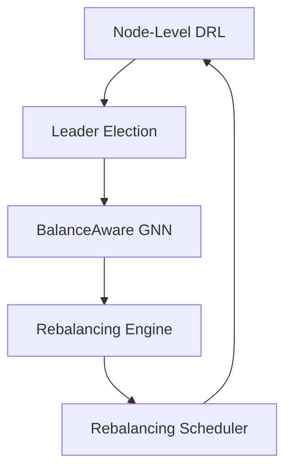

# DEBAL: Decentralized Balance-Aware Rebalancing for Payment Channel Networks


## Project Overview

DEBAL (Decentralized Balance-Aware Rebalancing) is an innovative solution for managing liquidity in payment channel networks (PCNs). It leverages advanced technologies including deep reinforcement learning (DRL), graph neural networks (GNNs), and decentralized coordination mechanisms to optimize network liquidity and transaction routing.

### Use Case
Payment channel networks often face liquidity imbalances that can hinder transaction processing. DEBAL addresses this challenge by providing an intelligent, decentralized system for maintaining optimal channel balances, ensuring smooth transaction flow across the network.

## 🌟 Key Features

- **Intelligent Liquidity Management**
  - Real-time liquidity assessment using DRL
  - Dynamic balance ratio monitoring
  - Predictive Time To Depletion (TTD) calculations

- **Decentralized Leadership**
  - Fair and secure leader election mechanism
  - Cryptographic verification of eligibility
  - Periodic leadership rotation

- **Advanced Path Optimization**
  - Graph Neural Network-based path calculation
  - Multi-hop transfer optimization
  - Atomic transaction execution

- **Robust Error Handling**
  - Automatic rollback mechanisms
  - Multi-cycle rebalancing support
  - Graceful failure recovery

## 🏗️ System Architecture

DEBAL's architecture consists of five core components that work together to maintain network liquidity:



### Core Components

1. **DEBALNodeState**
   - Manages node-level state
   - Tracks balance metrics
   - Calculates liquidity thresholds

2. **LeaderElection**
   - Handles decentralized leadership
   - Implements eligibility verification
   - Manages leader transitions

3. **BalanceAwareGNN**
   - Provides path optimization
   - Generates node embeddings
   - Scores potential paths

4. **RebalancingEngine**
   - Executes rebalancing operations
   - Manages atomic transfers
   - Handles error recovery

5. **RebalancingScheduler**
   - Coordinates rebalancing activities
   - Manages periodic re-elections
   - Tracks system state

## 🛠️ Technology Stack

- **Core Technologies**
  - Python 3.7+
  - PyTorch (≥ 1.9.0)
  - PyTorch Geometric (≥ 2.0.0)
  - NetworkX (≥ 2.6.0)

- **Simulation & Testing**
  - SimPy (≥ 4.0.0)
  - Gym (≥ 0.17.0)
  - TensorBoard (≥ 2.4.0)

## 🚀 Getting Started

### Prerequisites
- Python 3.7 or higher
- pip (Python package manager)
- Git

### Installation

1. Clone the repository:
```bash
git clone https://github.com/yourusername/DEBAL.git
cd DEBAL
```

2. Create and activate a virtual environment (recommended):
```bash
python -m venv venv
source venv/bin/activate  # On Windows: venv\Scripts\activate
```

3. Install dependencies:
```bash
pip install -r requirements.txt
```

## 💻 Usage

### Basic Implementation

```python
from debal import DEBALManager

# Initialize the DEBAL manager
manager = DEBALManager(
    env=simpy.Environment(),
    nodes=nodes,
    network_graph=network_graph,
    kappa=0.1,    # Minimum outgoing balance threshold
    theta=0.2,    # Minimum balance ratio threshold
    tau=2.0,      # TTD threshold in hours
    delta_t=600.0 # Re-election interval
)

# Start the rebalancing process
manager.start()

# Handle rebalancing requests
manager.handle_rebalancing_request(node)

# Execute rebalancing
success = manager.execute_rebalancing(source_node, target_node, amount)
```

### Configuration Parameters

| Parameter | Description | Default Value |
|-----------|-------------|---------------|
| kappa | Minimum outgoing balance threshold | 0.1 |
| theta | Minimum balance ratio threshold | 0.2 |
| tau | TTD threshold (hours) | 2.0 |
| delta_t | Re-election interval (seconds) | 600.0 |

## 📁 Project Structure

```
DEBAL/
├── src/
│   ├── core/
│   │   ├── node_state.py
│   │   ├── leader_election.py
│   │   └── rebalancing_engine.py
│   ├── models/
│   │   ├── gnn.py
│   │   └── drl.py
│   └── utils/
│       ├── graph_utils.py
│       └── metrics.py
├── tests/
│   ├── unit/
│   └── integration/
├── examples/
├── docs/
├── requirements.txt
└── README.md
```

## 🤝 Contributing

We welcome contributions! Please feel free to submit a Pull Request. For major changes, please open an issue first to discuss what you would like to change.

1. Fork the repository
2. Create your feature branch (`git checkout -b feature/AmazingFeature`)
3. Commit your changes (`git commit -m 'Add some AmazingFeature'`)
4. Push to the branch (`git push origin feature/AmazingFeature`)
5. Open a Pull Request

## 📝 License

This project is licensed under the MIT License - see the [LICENSE](LICENSE) file for details.

## 👥 Authors

- Your Name - Initial work - [YourGitHub](https://github.com/yourusername)

## 🙏 Acknowledgments

- Thanks to all contributors who have helped shape this project
- Special thanks to the open-source community for their invaluable tools and libraries
